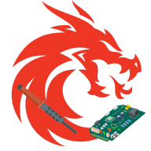

# CS Laboratorio 🔧

<p align="center">
  
</p>

Aplicación de escritorio desarrollada en Flutter para la **programación en masa de microcontroladores ESP32-C3** utilizados en equipos IoT Caldén Smart.  Esta herramienta optimiza el proceso de producción permitiendo flashear firmware, asignar números de serie y registrar dispositivos de forma automatizada.

## 📋 Características Principales

### 🔄 Programación Automatizada (Auto)
- **Flasheo masivo paralelo**: Programa múltiples ESP32-C3 simultáneamente
- **Descarga automática de firmware**: Obtiene la última versión desde GitHub (`barberop/sime-domotica`)
- **Generación automática de números de serie**: Formato `YYMMDDNN`
- **Registro en AWS IoT**: Crea automáticamente las "cosas" en AWS IoT Core
- **Reporte detallado**: Muestra el estado de cada dispositivo procesado

### 🛠️ Herramientas Manuales (Tools)
- **Programación de firmware**: Flasheo manual con selección de versión específica
- **Asignación de números de serie**: Carga secuencial de S/N a dispositivos conectados
- **Configuración flexible**: Código de producto y versión de hardware personalizable

### 📡 Monitor Serial
- **Comunicación bidireccional**: Envía y recibe datos por puerto serie
- **Múltiples puertos**: Gestiona varios dispositivos simultáneamente
- **Log en tiempo real**: Visualiza toda la comunicación con timestamps

### ☁️ Thing Maker
- **Registro manual en AWS**: Crea dispositivos IoT individualmente
- **Gestión por lotes**: Permite agregar múltiples dispositivos para registro masivo
- **Validación de datos**: Verifica formato de código de producto y número de serie

## 🚀 Requisitos del Sistema

- **Sistema Operativo**: Windows 10/11
- **Conexiones USB**: Puertos disponibles para ESP32-C3
- **Python Embebido**: Incluido en la aplicación (esptool)
- **Conexión a Internet**: Para descargar firmware y registrar en AWS

## 📦 Instalación

### Desde Código Fuente

```bash
# Clonar el repositorio
git clone https://github.com/Azthriel/CSLAB.git
cd CSLAB

# Instalar dependencias
flutter pub get

# Compilar para Windows
flutter build windows --release

# El ejecutable estará en: build\windows\x64\runner\Release\
```

## 🔧 Configuración

### Estructura de Firmware en GitHub
La aplicación descarga automáticamente los binarios desde:
```
https://github.com/barberop/sime-domotica/
└── [PRODUCTO_IOT]/
    └── LAB_FILES/
        └── [HW_VERSION]_[SOFTWARE_VERSION]_F/
            ├── bootloader.bin
            ├── partitions.bin
            └── firmware.bin
```

### Proceso de Flasheo
El proceso utiliza **esptool** con los siguientes parámetros:
- **Chip**: ESP32-C3
- **Velocidad**: 576000 baudios
- **Particiones**:
  - `0x0000`: bootloader. bin
  - `0x8000`: partitions.bin
  - `0xE000`: boot_app0.bin (incluido en assets)
  - `0x10000`: firmware.bin

## 📖 Uso

### Modo Automático (Recomendado)

1. **Conectar dispositivos**: Conecta todos los ESP32-C3 a puertos USB
2. **Seleccionar puertos**: Usa el menú desplegable para elegir puertos
3. **Ingresar datos**:
   - Código de producto (ej: `CALDEN_IOT`)
   - Versión de hardware (ej: `1.0`)
   - Número de serie inicial (ej: `01`)
4. **Ejecutar**: Presiona "Ejecutar Todo"
5. **Verificar reporte**: Revisa el estado de cada dispositivo

### Modo Manual (Tools)

#### Programar Firmware
1. Selecciona los puertos COM
2. Ingresa código de producto y versión HW
3. Presiona "Programar"

#### Cargar Números de Serie
1. Selecciona los puertos COM
2.  Ingresa el número inicial
3. Los números se asignan secuencialmente

### Monitor Serial
- Selecciona puerto y velocidad (baudios)
- Envía comandos en formato JSON
- Visualiza respuestas en tiempo real

## 🏗️ Arquitectura del Proyecto

```
lib/
├── main.dart           # Punto de entrada
├── menu.dart           # Navegación principal y gestión de puertos
├── auto.dart           # Modo automático (flasheo + AWS)
├── tools.dart          # Herramientas manuales
├── thingmaker.dart     # Registro manual en AWS
├── serial. dart         # Monitor de comunicación serial
├── serial_log.dart     # Log detallado de operaciones
└── master.dart         # Servicios compartidos y utilidades

assets/
├── LogoApp.png         # Icono de la aplicación
├── boot_app0.bin       # Binario de partición boot
└── python-embed.zip    # Python portable con esptool
```

## 🔑 Dependencias Principales

- **flutter_libserialport**: Comunicación por puerto serie
- **http**: Descarga de firmware desde GitHub
- **path_provider**: Gestión de directorios temporales
- **fluttertoast**: Notificaciones al usuario
- **mqtt_client**: Comunicación IoT (futuras implementaciones)

## 📝 Formato de Números de Serie

Los números de serie se generan automáticamente con el formato:
```
YYMMDDNN
```
- **YY**: Año (2 dígitos)
- **MM**: Mes (2 dígitos)
- **DD**: Día (2 dígitos)
- **NN**: Número secuencial (2 dígitos)

**Ejemplo**: `25120101` → 1 de diciembre de 2025, dispositivo #01

## 🐛 Solución de Problemas

### Error: "Puerto COM no disponible"
- Verifica que el driver CP210x o CH340 esté instalado
- Desconecta y reconecta el dispositivo
- Reinicia la aplicación

### Error: "Failed to download firmware"
- Verifica tu conexión a Internet
- Confirma que exista el firmware en GitHub con la versión correcta
- Revisa el formato: `[PRODUCTO]_IOT` / `[HW]_[SW]_F`

### Error al flashear
- Asegúrate de que el ESP32-C3 esté en modo bootloader
- Verifica que no haya otro programa usando el puerto COM
- Intenta reducir la velocidad de baudios

## 🤝 Contribuciones

Las contribuciones son bienvenidas. Por favor:
1. Fork el proyecto
2. Crea una rama para tu feature (`git checkout -b feature/AmazingFeature`)
3.  Commit tus cambios (`git commit -m 'Add some AmazingFeature'`)
4. Push a la rama (`git push origin feature/AmazingFeature`)
5.  Abre un Pull Request

## 📄 Licencia

Ver archivo `LICENSE. txt` para más detalles. 

## 👤 Autor

**Azthriel**
- GitHub: [@Azthriel](https://github.com/Azthriel)
- Proyecto: [CSLAB](https://github.com/Azthriel/CSLAB)

## 🔗 Enlaces Relacionados

- [Repositorio de Firmware](https://github.com/barberop/sime-domotica)
- [ESP32-C3 Documentation](https://www.espressif.com/en/products/socs/esp32-c3)
- [Esptool Documentation](https://docs.espressif.com/projects/esptool/)

---

**Versión Actual**: 16.0.61

**Última Actualización**: Diciembre 2025
